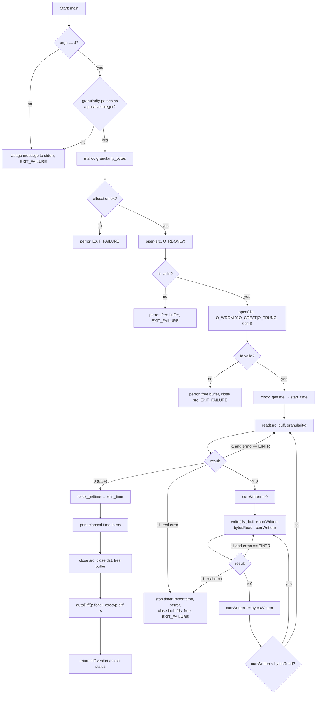

# my_cp — Granularity-Based File Copy Using Raw System Calls

**Assignment No. 1 — System Programming**
**Yotam Weintraub — ID: 321610859**
Repository: <https://github.com/YuutamW/my_cp-System-Programming>

---

## 1. Overview

`my_cp` is a C implementation of a file-copy utility that works directly against the
Linux kernel through system calls instead of the
buffered `stdio` library.

The size of the block moved on every read/write round-trip — the **granularity** — is
supplied by the user at run time. The program allocates its buffer dynamically to that
exact size and measures the total wall-clock time spent inside the I/O loop, so the
effect of the granularity on the cost of crossing the User Space ↔ Kernel Space boundary
can be observed empirically.

### Goals covered

| Requirement | Where it is implemented |
|---|---|
| Exactly 3 CLI arguments, validated | `verifyArgs()`, `granParamValidation()` |
| Granularity parsed as an integer and verified to be positive | `verifyArgs()` via `strtol` |
| Dynamic buffer of `granularity_bytes` (no fixed static buffer) | `ALLOC_BUFF` macro → `malloc`, released with `FREE_BUFF` → `free` |
| Source opened `O_RDONLY`, destination `O_WRONLY\|O_CREAT\|O_TRUNC` with mode `0644` | `main()` |
| Robust I/O loop: `EINTR` retry, EOF stop condition, partial-write handling | `main()` read/write loops |
| Internal timing of the I/O loop only | `MEASURE_TIME` macro → `clock_gettime(CLOCK_MONOTONIC, …)`, `calcElapsedTime()` |
| All descriptors closed on both success and failure paths | `main()` |
| **Bonus:** automatic correctness check via `fork` + `exec` | `autoDiff()` |

---

## 2. Build

The program is a single translation unit and is built exactly with the flags required by
the assignment:

```bash
gcc -Wall -Wextra -std=gnu11 -O2 my_cp.c -o my_cp
```

A `Makefile` automates this:

```bash
make            # build ./my_cp
make run        # build and run with the default demo arguments
make test       # build, copy, and verify with diff -s
make rebuild    # clean + build
make clean      # remove the executable and benchmark temp files
```

The `run` / `test` targets accept overrides:

```bash
make run SRC_FILE=source.txt DST_FILE=destination.txt GRAN=4096
```

Tested on Linux (kernel 7, `gcc` 15.2.0, x86-64).

---

## 3. Usage

```bash
./my_cp <source_file> <destination_file> <granularity_bytes>
```

| Argument | Meaning |
|---|---|
| `source_file` | Path of the file to read from. Must exist and be readable. |
| `destination_file` | Path to write to. Created if missing (mode `0644`), truncated if it already exists. |
| `granularity_bytes` | Positive integer — the block size, in bytes, used by every `read()`/`write()` call (e.g. `1`, `100`, `4096`). |

### Example

```console
$ ./my_cp source.txt destination.txt 4096
I/O completed Successfuly total time: 0.042ms with granularity value (4096)

--- Automating diff check (Fork/Exec) ---
Files source.txt and destination.txt are identical
Diff check passed: Files are identical.
```

### Exit status

| Code | Meaning |
|---|---|
| `0` (`EXIT_SUCCESS`) | Copy completed and the automatic `diff` check confirmed the files are identical. |
| `1` (`EXIT_FAILURE`) | Bad arguments, allocation failure, `open`/`read`/`write` failure, or the `diff` verification did not pass. |

### Benchmarking helper

`benchmark.sh` generates a 1 GB random file, copies it with a large granularity, compares
the result and cleans up afterwards. Running the program with several granularity values
(e.g. `1`, `512`, `4096`, `65536`) shows the cost of the system-call overhead: a very small
granularity forces millions of user↔kernel transitions and is dramatically slower than a
block size aligned with the page/filesystem block size, while very large blocks give
diminishing returns.

---

## 4. Design Document

### 4.1 System calls used

| System call | Header | Purpose in the program | Flags / arguments |
|---|---|---|---|
| `open()` | `<fcntl.h>` | Opens the **source** file and returns a file descriptor — an index into the process's File Descriptor Table. | `O_RDONLY` — read-only access; no creation, so a missing source is an error. |
| `open()` | `<fcntl.h>` | Opens/creates the **destination** file. | `O_WRONLY` (write-only) `\|` `O_CREAT` (create if absent) `\|` `O_TRUNC` (wipe existing content), mode `0644` = `-rw-r--r--`: owner read+write, group and others read-only. The mode argument is only consulted when the file is actually created. |
| `read()` | `<unistd.h>` | Asks the kernel to copy up to `granularity_bytes` from the source into the user-space buffer. The process is blocked until the filesystem delivers the data. | Returns the number of bytes actually read, `0` at EOF, `-1` on error. |
| `write()` | `<unistd.h>` | Hands a chunk of the buffer to the kernel to be written to the destination descriptor. | Returns the number of bytes actually written — which may be **fewer** than requested. |
| `close()` | `<unistd.h>` | Releases both descriptors, on the success path and on every error path. | Prevents descriptor leaks and lets the kernel flush its own state for the file. |
| `clock_gettime()` | `<time.h>` | Takes the two timing measurements around the I/O loop. | `CLOCK_MONOTONIC` — immune to wall-clock adjustments (manual changes, NTP), which makes it the correct clock for benchmarking. |
| `fork()` (bonus) | `<unistd.h>` | Duplicates the process so the copy can be verified without terminating the parent. | Returns `0` in the child, the child's PID in the parent, `-1` on failure. |
| `execvp()` (bonus) | `<unistd.h>` | Replaces the child's image with the external `diff` program. | `argv` vector `{"diff", "-s", src, dst, NULL}`; `p` = resolve the binary through `PATH`. Returns **only** if the exec failed. |
| `waitpid()` (bonus) | `<sys/wait.h>` | Parent blocks until the child terminates, then inspects its status. | `WIFEXITED` — did it exit normally; `WEXITSTATUS` — the 8-bit exit code (`diff`: `0` identical, `1` differ, `2` trouble). |

Supporting library calls: `malloc`/`free` (`<stdlib.h>`) for the dynamic buffer,
`strtol` for parsing the granularity, `perror`/`fprintf(stderr, …)` (`<stdio.h>`) for
diagnostics, and `errno` (`<errno.h>`) for distinguishing an interrupted call from a real
failure.

### 4.2 Program flow



In words:

1. **Argument validation** — `verifyArgs()` requires exactly 4 `argv` entries, converts
   `argv[3]` with `strtol` (base 10), rejects input containing no digits, and delegates to
   `granParamValidation()`, which rejects zero and negative sizes. Any violation prints an
   informative message to `stderr` and exits with `EXIT_FAILURE`.
2. **Buffer allocation** — a buffer of exactly `granularity_bytes` is allocated with
   `malloc`. A static, compile-time buffer is deliberately not used, as required.
3. **Opening the files** — source read-only, destination write-only/create/truncate with
   permissions `0644`. Both return values are checked and reported with `perror()`.
4. **First measurement** — taken immediately after both files are open successfully and
   *before* the loop starts, so open/close costs are excluded from the result.
5. **Copy loop** — read one block, then an inner loop writes it out completely before the
   next read. The loop ends when `read()` returns `0` (EOF).
6. **Second measurement** — taken immediately after the loop exits and *before* the
   descriptors are closed; `calcElapsedTime()` computes the difference, borrows a whole
   second when the nanosecond delta is negative, and prints the total in milliseconds with
   three decimal places (`%.3f`).
7. **Cleanup** — `close()` on both descriptors, `free()` on the buffer. Every error path
   performs the same cleanup before exiting.
8. **Automatic verification (bonus)** — see §4.4.

### 4.3 Error handling

| Situation | Detection | Reaction |
|---|---|---|
| Wrong number of arguments | `argc != 4` | Usage line on `stderr`, `EXIT_FAILURE`. |
| Non-numeric granularity | `strtol` leaves `endPtr == argv[3]` | Explanatory message on `stderr`, `EXIT_FAILURE`. |
| Zero / negative granularity | `granParamValidation()` | Explanatory message on `stderr`, `EXIT_FAILURE`. |
| `malloc` failure | `NULL` return | `perror`, `EXIT_FAILURE`. |
| `open` failure (either file) | negative descriptor | `perror` with the exact `errno` text, release everything already acquired, `EXIT_FAILURE`. |
| **Interrupted call** | `read`/`write` return `-1` **and** `errno == EINTR` | Not an error — the operation is simply retried by `continue`ing the loop. |
| Real `read`/`write` error | `-1` with any other `errno` | Timer is stopped and the (unsuccessful) elapsed time is reported, `perror`, both descriptors closed, buffer freed, `EXIT_FAILURE`. |
| **Partial write** | `bytesWritten < bytesRead - currWritten` | The inner `while (currWritten < bytesRead)` loop keeps writing from `buff + currWritten` until the whole block has reached the destination, so no bytes are ever silently dropped. |
| `fork` failure | `pid < 0` | `perror("Fork failed")`, `EXIT_FAILURE`. |
| `execvp` failure | the call returns at all | `perror("execvp failed")` and failure status. |
| Child killed / crashed | `WIFEXITED(status)` is false | Reported, `EXIT_FAILURE`. |
| Files differ after copy | `WEXITSTATUS(status) != 0` | Reported with the `diff` exit code, `EXIT_FAILURE`. |

### 4.4 Bonus — automatic verification with `fork` + `exec`

Instead of asking the user to run `diff` manually, `autoDiff()` performs the check as part
of the program:

* `fork()` creates a child process — an (almost) exact duplicate of the running program.
* In the **child** (`pid == 0`), `execvp("diff", {"diff", "-s", src, dst, NULL})` replaces
  the process image with the `diff` binary found through `PATH`. `-s` makes `diff` report
  explicitly when the files are identical. Because `exec` replaces the image, any code
  after it runs only if the exec itself failed.
* In the **parent** (`pid > 0`), `waitpid()` blocks until the child terminates, then
  `WIFEXITED`/`WEXITSTATUS` unpack the status word. `diff` exits `0` when the files are
  identical, `1` when they differ, `2` on trouble — so the verdict is translated into
  `my_cp`'s own exit status.

This demonstrates the classic UNIX process-creation model (`fork` to duplicate,
`exec` to specialize, `wait` to synchronize) and makes every run self-verifying.

---

## 5. Repository contents

| File | Description |
|---|---|
| `my_cp.c` | The assignment's source code (single translation unit, fully commented). |
| `Makefile` | Automated build with the required compilation flags, plus `run`, `test`, `rebuild`, `clean`. |
| `my_cp` | Compiled executable (x86-64 Linux). |
| `README.md` | This document — usage instructions and the accompanying design document. |
| `ex1.pdf` | The original assignment specification. |

Local working files that are intentionally excluded from the repository by `.gitignore`:
`benchmark.sh` (1 GB copy benchmark), `source.txt` / `destination.txt` (small manual test
input/output), and the course reference examples `simple_cp.c`, `simple_cp_syscall.c`,
`testSysCall.c`, which are **not** part of the submission.
